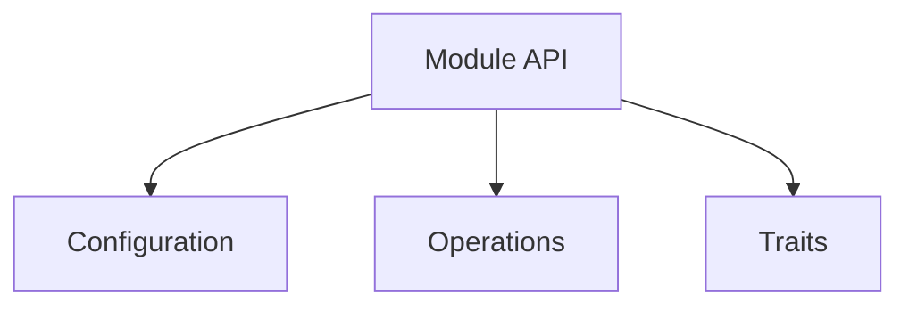

# [Module Name] - [Brief Description]

**Date**: YYYY-MM-DD
**Status**: [Complete | In Progress | Planned]
**Phase**: [Phase A | Phase B | Phase C | etc.]

---

## Overview

Brief description of what this module provides (1-2 paragraphs).

## Features

- Feature 1
- Feature 2
- Feature 3

## Hardware Registers

List of registers accessed by this module:

- `REGISTER_NAME` - Description
- `REGISTER_NAME` - Description

## API Structure



## Usage Example

```rust
use efr32mg24_hal::module_name::*;

fn main() {
    // Example code here
}
```

## Implementation Details

### Type Safety

How type-state pattern or other safety mechanisms are used.

### Zero-Cost Abstractions

Explain how `#[inline]` and other optimizations are applied.

### Critical Sections

Where and why critical sections are used for atomicity.

## embedded-hal Traits

List of implemented traits:

- `embedded_hal::Trait` - Implementation status

## Build Configuration

```toml
[dependencies]
efr32mg24-hal = { version = "0.1", features = ["module_name"] }
```

## Testing

How to test this module (examples, hardware requirements).

## Known Limitations

- Limitation 1
- Limitation 2

## Future Work

- Future enhancement 1
- Future enhancement 2

## References

- [EFR32MG24 Reference Manual](link) - Section X
- [embedded-hal Documentation](link)

---

<!-- META: last_updated=YYYY-MM-DD version=X.Y.Z maintainer=Name status=Complete -->
