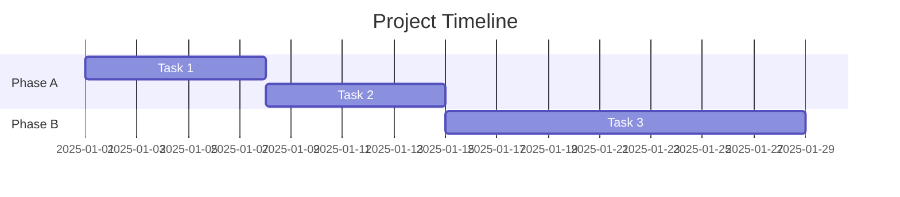

# [Project Name] - Development Plan

**Date**: YYYY-MM-DD
**Status**: Active
**SSOT**: Yes

---

## Vision

High-level project vision and goals (1-2 paragraphs).

## Success Criteria

- Criteria 1
- Criteria 2
- Criteria 3

## Development Phases

### Phase A: [Name] (Estimated: X weeks)

**Goal**: Brief description

**Deliverables**:
- Deliverable 1
- Deliverable 2
- Deliverable 3

**Completion Criteria**:
- [ ] Criterion 1
- [ ] Criterion 2

**Status**: [Complete | In Progress | Not Started]
**Progress**: XX%

---

### Phase B: [Name] (Estimated: X weeks)

**Goal**: Brief description

**Deliverables**:
- Deliverable 1
- Deliverable 2
- Deliverable 3

**Completion Criteria**:
- [ ] Criterion 1
- [ ] Criterion 2

**Status**: [Complete | In Progress | Not Started]
**Progress**: XX%

---

## Timeline

## Milestones

| Milestone | Target Date | Status | Notes |
|-----------|-------------|--------|-------|
| Phase A Complete | YYYY-MM-DD | Complete | |
| Phase B Complete | YYYY-MM-DD | In Progress | |
| Phase C Start | YYYY-MM-DD | Not Started | |

## Resource Requirements

### Tools
- Tool 1: version
- Tool 2: version

### Dependencies
- Dependency 1: version
- Dependency 2: version

### Documentation
- Document 1
- Document 2

## Risks and Mitigations

| Risk | Probability | Impact | Mitigation |
|------|-------------|--------|------------|
| Risk 1 | High | High | Mitigation strategy |
| Risk 2 | Medium | Low | Mitigation strategy |

## Future Considerations

Beyond current plan:

- Consideration 1
- Consideration 2

## Review Schedule

- Weekly: Progress review
- Monthly: Milestone review
- Quarterly: Strategic review

---

<!-- META: last_updated=YYYY-MM-DD version=X.Y.Z next_review=YYYY-MM-DD -->
