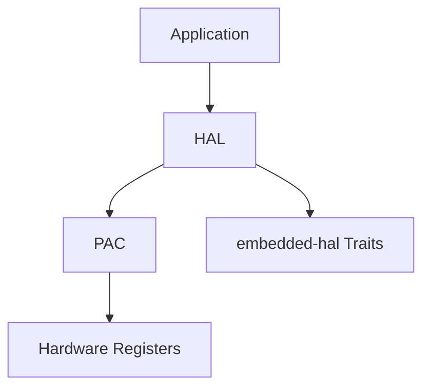

# [Project Name]

**Brief one-line description of the project**

[](link)
[](LICENSE)
[](https://www.rust-lang.org)

---

## Overview

1-2 paragraph description of what this project provides and why it exists.

**Target Hardware**: Specific hardware this targets (e.g., "Seeed Studio XIAO MG24 Sense")

**Current Status**: Brief status (e.g., "Phase B - 70% complete")

## Features

- Feature 1
- Feature 2
- Feature 3
- embedded-hal v1.0 support
- no_std compatible

## Quick Start

### Prerequisites

```bash
# Install Rust
curl --proto '=https' --tlsv1.2 -sSf https://sh.rustup.rs | sh

# Add target
rustup target add thumbv8m.main-none-eabihf

# Install tools
cargo install probe-rs --locked
```

### Installation

```toml
[dependencies]
project-name = "0.1.0"
```

### Basic Example

```rust
#![no_std]
#![no_main]

use project_name::prelude::*;

#[entry]
fn main() -> ! {
    // Example code
    loop {}
}
```

## Project Structure

```
project/
├── Cargo.toml              # Workspace root
├── crate-name/             # Main crate
│   ├── src/
│   │   ├── lib.rs
│   │   ├── module1/
│   │   └── module2/
│   ├── examples/
│   └── docs/
├── docs/                   # Project documentation
│   ├── README.md
│   ├── PLAN.md
│   ├── STATUS.md
│   ├── BACKLOG.md
│   └── LOG.md
└── README.md              # This file
```

## Documentation

- **[Project Plan](docs/PLAN.md)** - Strategic roadmap and phases
- **[Current Status](docs/STATUS.md)** - Implementation status
- **[Task Backlog](docs/BACKLOG.md)** - Current tasks and priorities
- **[Milestone Log](docs/LOG.md)** - Achievement history
- **[API Documentation](link)** - Generated rustdoc

## Examples

Build and run examples:

```bash
# List available examples
cargo build --examples --features rt

# Run specific example
cargo run --example example_name --features rt --release
```

**Available Examples**:
- `01_example.rs` - Description
- `02_example.rs` - Description
- `03_example.rs` - Description

See `examples/` directory for complete list.

## Development

### Building

```bash
# Check code
cargo check --features rt

# Build library
cargo build --features rt --release

# Build with all features
cargo build --all-features --release

# Build documentation
cargo doc --no-deps --open
```

### Testing

```bash
# Run tests (if applicable)
cargo test --features rt

# Run with hardware (requires probe)
cargo run --example test --features rt --release
```

### Code Quality

```bash
# Format code
cargo fmt

# Lint code
cargo clippy --features rt

# Check for security issues
cargo audit
```

## Hardware Setup

### Required Hardware

- Hardware component 1
- Hardware component 2
- Debugger/programmer (e.g., J-Link, ST-Link)

### Connections

```
MCU Pin  | Function    | Connect To
---------|-------------|------------
PA0      | GPIO OUT    | LED
PA1      | GPIO IN     | Button
...
```

### Flashing

```bash
# Using probe-rs
cargo run --example blinky --features rt --release

# Using other tools
# (Instructions for alternative flashing methods)
```

## Architecture



Brief explanation of architecture layers.

## Contributing

Contributions are welcome! Please:

1. Read [CONTRIBUTING.md](CONTRIBUTING.md) (if exists)
2. Fork the repository
3. Create a feature branch
4. Make your changes
5. Submit a pull request

### Development Guidelines

- Follow Rust API guidelines
- Add documentation for public APIs
- Include examples for new features
- Ensure code passes `cargo fmt` and `cargo clippy`

## Roadmap

See [docs/PLAN.md](docs/PLAN.md) for detailed roadmap.

**Upcoming Milestones**:
- Milestone 1 - Target date
- Milestone 2 - Target date
- Milestone 3 - Target date

## Performance

Brief performance characteristics if relevant:

- Build time: ~X minutes
- Binary size: ~X KB (release)
- RAM usage: ~X KB
- Benchmarks: (if applicable)

## Compatibility

- **Rust Version**: 1.70+ (MSRV)
- **Target**: thumbv8m.main-none-eabihf
- **embedded-hal**: v1.0
- **Platforms**: Specific hardware/chip families

## Troubleshooting

### Common Issues

**Issue 1**: Description
- **Solution**: Steps to resolve

**Issue 2**: Description
- **Solution**: Steps to resolve

See [docs/TROUBLESHOOTING.md](docs/TROUBLESHOOTING.md) for more.

## License

Licensed under either of:

- Apache License, Version 2.0 ([LICENSE-APACHE](LICENSE-APACHE) or http://www.apache.org/licenses/LICENSE-2.0)
- MIT license ([LICENSE-MIT](LICENSE-MIT) or http://opensource.org/licenses/MIT)

at your option.

### Contribution

Unless you explicitly state otherwise, any contribution intentionally submitted for inclusion in the work by you, as defined in the Apache-2.0 license, shall be dual licensed as above, without any additional terms or conditions.

## Acknowledgments

- Acknowledgment 1
- Acknowledgment 2
- Reference project inspiration

## Contact

- **Author**: Your Name <email@example.com>
- **Repository**: https://github.com/username/repo
- **Issues**: https://github.com/username/repo/issues
- **Discussions**: https://github.com/username/repo/discussions

---

<!-- META: last_updated=YYYY-MM-DD version=X.Y.Z status=Active_Development maintainer=Name -->
