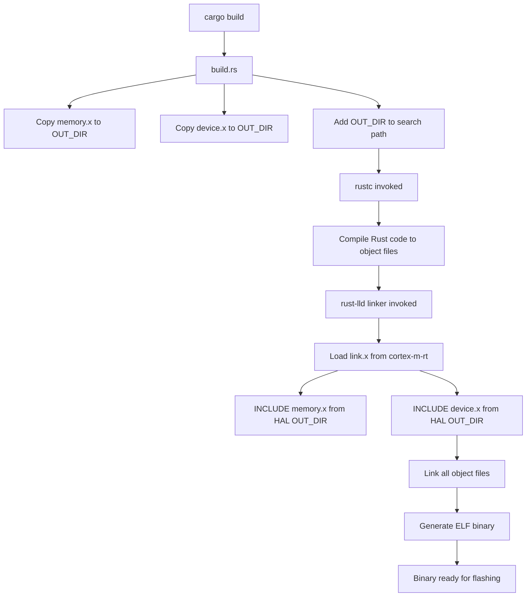
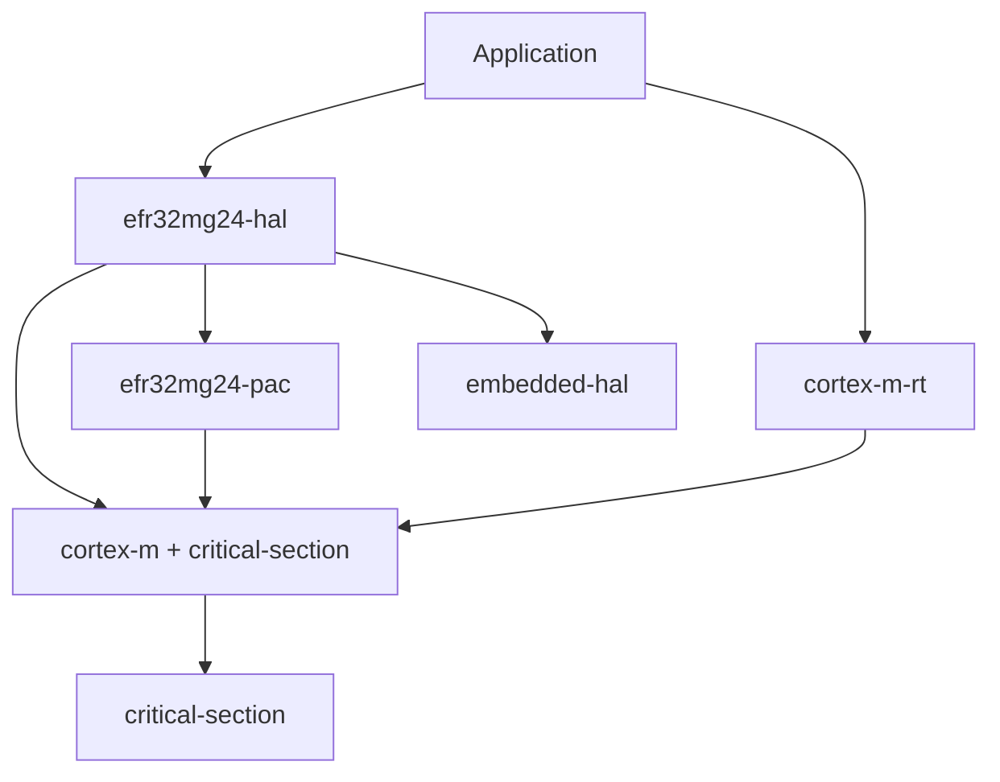

# Build System Documentation

This document explains the complete build system for the EFR32MG24 HAL, including how Cargo, rustc, and the linker work together to produce ARM Cortex-M binaries.

## Build Pipeline Overview



## Build Script Execution (build.rs)

The build script runs **before** compilation and sets up the linker environment.

### Execution Flow

1. **Cargo invokes build.rs** as part of pre-build phase
2. **Script copies linker scripts** to `$OUT_DIR`:
   - `memory.x` → `$OUT_DIR/memory.x`
   - `device.x` → `$OUT_DIR/device.x`
3. **Script emits cargo instructions**:
   - `cargo:rustc-link-search=$OUT_DIR` - Adds OUT_DIR to linker search path
   - `cargo:rerun-if-changed=memory.x` - Rebuilds if memory.x changes
   - `cargo:rerun-if-changed=device.x` - Rebuilds if device.x changes

### Why Copy to OUT_DIR?

The linker searches for included files in specific directories:
1. Current directory
2. Directories specified with `-L` (linker search path)

By copying to OUT_DIR and adding it to the search path, we ensure the linker can find our device-specific scripts when `link.x` uses `INCLUDE` directives.

## Compilation Phase

### Source Files → Object Files

```bash
rustc \
  --crate-name 01_clock \
  --edition=2021 \
  examples/01_clock.rs \
  --crate-type bin \
  --target thumbv8m.main-none-eabihf \
  -C opt-level=z \
  -C lto \
  -C codegen-units=1 \
  --extern efr32mg24_hal=...rlib \
  --extern cortex_m=...rlib \
  --extern cortex_m_rt=...rlib \
  -L dependency=target/thumbv8m.main-none-eabihf/release/deps
```

**Key Flags:**
- `--target thumbv8m.main-none-eabihf` - Target Cortex-M33 with HW FPU
- `-C opt-level=z` - Optimize for size
- `-C lto` - Link-time optimization
- `-C codegen-units=1` - Single codegen unit for better optimization
- `--extern` - Links against compiled crate dependencies

**Output:** Object file (`.rcgu.o`) for each code generation unit

## Linking Phase

### Object Files → ELF Binary

The linker (`rust-lld`) combines all object files and resolves symbols.

```bash
rust-lld \
  -flavor gnu \
  symbols.o \
  01_clock.rcgu.o \
  libefr32mg24_hal.rlib \
  libcortex_m.rlib \
  libcortex_m_rt.rlib \
  --gc-sections \
  -Tlink.x \
  -L OUT_DIR_efr32mg24_hal \
  -L OUT_DIR_cortex_m_rt \
  -o 01_clock
```

**Key Flags:**
- `-flavor gnu` - Use GNU ld-compatible mode
- `--gc-sections` - Remove unused sections (size optimization)
- `-Tlink.x` - Use link.x as primary linker script
- `-L` - Add directories to linker search path
- `-o` - Output file path

### Linker Script Processing

1. **rust-lld loads `link.x`** from cortex-m-rt OUT_DIR
2. **link.x line 23**: `INCLUDE memory.x`
   - Linker searches for memory.x in search paths
   - Finds it in efr32mg24-hal OUT_DIR
3. **link.x line 283**: `INCLUDE device.x`
   - Linker searches for device.x
   - Finds it in efr32mg24-hal OUT_DIR
4. **Linker processes all three scripts** as single unified script

### Memory Layout Resolution

From memory.x:
```ld
MEMORY
{
  FLASH : ORIGIN = 0x08000000, LENGTH = 1536K
  RAM   : ORIGIN = 0x20000000, LENGTH = 256K
}
```

The linker:
1. Places `.vector_table` at `0x08000000` (start of FLASH)
2. Places `.text` (code) after vector table
3. Places `.rodata` (constants) after text
4. Places `.data` (initialized variables) in RAM, with LMA in FLASH
5. Places `.bss` (zero-initialized) in RAM
6. Places stack at end of RAM (`0x20040000`)

### Symbol Resolution

**Provided by cortex-m-rt (link.x):**
- `Reset` - Reset handler (entry point)
- `DefaultHandler` - Default interrupt handler
- `HardFault` - Hard fault handler
- Exception vector symbols (NonMaskableInt, SysTick, etc.)

**Provided by device.x:**
- All device-specific interrupt handlers (TIMER0, GPIO_ODD, etc.)
- All default to `DefaultHandler` unless overridden

**Provided by critical-section (cortex-m):**
- `_critical_section_1_0_acquire`
- `_critical_section_1_0_release`

**Provided by user code:**
- `__cortex_m_rt_main` (from `#[entry]` macro)
- Custom interrupt handlers (if defined with `#[interrupt]`)

### Section Placement

**FLASH (non-volatile, read-only):**
```
0x08000000  ┌─────────────────────────┐
            │  .vector_table          │  Reset vector, exceptions, interrupts
            ├─────────────────────────┤
            │  .text                  │  Program code
            ├─────────────────────────┤
            │  .rodata                │  Read-only data (constants, strings)
            ├─────────────────────────┤
            │  .data (LMA)            │  Initial values for .data in RAM
            └─────────────────────────┘
0x0817FFFF
```

**RAM (volatile, read-write):**
```
0x20000000  ┌─────────────────────────┐
            │  .data (VMA)            │  Initialized variables
            ├─────────────────────────┤
            │  .bss                   │  Zero-initialized variables
            ├─────────────────────────┤
            │  .uninit                │  Uninitialized variables
            ├─────────────────────────┤
            │  Heap (grows up ↑)      │  Dynamic allocation
            │  ...                    │
            │  Stack (grows down ↓)   │  Function calls, locals
            └─────────────────────────┘
0x2003FFFF
```

## Startup Sequence

When the microcontroller boots:

1. **CPU reads initial SP** from `0x08000000` (first word of vector table)
2. **CPU reads Reset vector** from `0x08000004` (second word)
3. **CPU jumps to Reset handler** (provided by cortex-m-rt)
4. **Reset handler**:
   - Calls `__pre_init()` if defined
   - Copies `.data` from FLASH to RAM
   - Zeros `.bss` section in RAM
   - Calls `__cortex_m_rt_main` (user's `#[entry]` function)

## Optimization Levels

The project uses aggressive optimizations for embedded targets.

### Release Profile

```toml
[profile.release]
opt-level = "z"       # Optimize for size
lto = true            # Link-time optimization
codegen-units = 1     # Single codegen unit
debug = true          # Keep debug symbols
```

**Size Comparison:**
- Without LTO: ~900 KB
- With LTO: ~700 KB
- **Savings: ~22%**

### Why Size Matters

Embedded systems have limited Flash:
- Smaller binaries = more space for user code/data
- Faster flashing and OTA updates
- Lower power consumption during Flash reads

### Debug Symbols

Even in release mode, we keep debug symbols (`debug = true`):
- Enables better stack traces
- Allows source-level debugging with GDB/probe-rs
- Doesn't affect Flash usage (symbols not included in binary)

## Feature Flags

### `rt` Feature

The HAL provides an optional `rt` feature for runtime support:

```toml
[features]
rt = ["efr32mg24-pac/rt", "cortex-m-rt"]
```

**When enabled:**
- Includes `cortex-m-rt` for startup code and linker script
- Enables interrupt vector table in PAC
- Allows use of `#[entry]` and `#[interrupt]` macros

**When disabled:**
- Library-only mode
- No startup code or linker scripts
- For use in environments that provide their own runtime

### Critical Section Feature

Automatically enabled via dependency:

```toml
cortex-m = { features = ["critical-section-single-core"] }
```

**Provides:**
- Safe single-core critical sections via interrupt masking
- Required for `Peripherals::take()` singleton pattern

## Dependency Graph



**Crate Roles:**
- **efr32mg24-hal**: High-level hardware abstractions
- **efr32mg24-pac**: Low-level peripheral register access
- **cortex-m-rt**: Startup code and linker script
- **cortex-m**: Core Cortex-M functionality and critical sections
- **embedded-hal**: Trait definitions for portable drivers
- **critical-section**: Critical section abstraction

## Build Commands Reference

### Development Builds

```bash
# Check code without building
cargo check --examples --features rt

# Build debug version (faster compile, larger binary)
cargo build --example 01_clock --features rt

# Run with probe-rs (builds + flashes + debugs)
cargo run --example 01_clock --features rt
```

### Release Builds

```bash
# Build optimized binary
cargo build --example 01_clock --features rt --release

# Build all examples
cargo build --examples --features rt --release

# Flash optimized binary
cargo run --example 01_clock --features rt --release
```

### Size Analysis

```bash
# Show section sizes
cargo size --example 01_clock --features rt --release

# Detailed size breakdown
arm-none-eabi-size -A target/thumbv8m.main-none-eabihf/release/examples/01_clock

# Binary size on disk
ls -lh target/thumbv8m.main-none-eabihf/release/examples/01_clock
```

### Cleaning

```bash
# Clean build artifacts (good for troubleshooting)
cargo clean

# Clean and rebuild
cargo clean && cargo build --examples --features rt --release
```

### Verbose Output

```bash
# See full compiler commands
cargo build --example 01_clock --features rt --release -v

# See full compiler AND linker commands
cargo build --example 01_clock --features rt --release -vv
```

## Troubleshooting Build Issues

### "region 'FLASH' already defined"

**Problem:** memory.x processed twice

**Check:**
```bash
# Look for duplicate -Tmemory.x flags
cargo build --example 01_clock --features rt --release -vv 2>&1 | grep -- "-T"
```

**Expected output:**
```
-Tlink.x
```

**Wrong output:**
```
-Tlink.x -Tmemory.x
```

**Fix:** Remove `-Tmemory.x` from `.cargo/config.toml`

### "undefined symbol" errors

**Problem:** Missing symbols for interrupts or critical sections

**Check:**
```bash
# Look for undefined symbols
cargo build --example 01_clock --features rt --release 2>&1 | grep "undefined symbol"
```

**Fix:**
- For interrupts: Add to device.x
- For critical sections: Enable feature in cortex-m dependency

### "cannot find memory.x"

**Problem:** build.rs not working correctly

**Check:**
```bash
# Verify build script ran
cargo clean
cargo build --example 01_clock --features rt --release -v 2>&1 | grep "Running.*build.rs"

# Check if OUT_DIR is in search path
cargo build --example 01_clock --features rt --release -vv 2>&1 | grep "rustc-link-search"
```

**Fix:** Ensure build.rs exists and has correct permissions

### Long compile times

**Problem:** LTO and opt-level=z are slow

**Workaround:**
```bash
# Use dev profile for faster iteration
cargo build --example 01_clock --features rt

# Or temporarily disable LTO in Cargo.toml
[profile.release]
lto = false  # Faster builds, larger binaries
```

## CI/CD Considerations

For continuous integration:

```yaml
# .github/workflows/ci.yml example
- name: Install ARM target
  run: rustup target add thumbv8m.main-none-eabihf

- name: Check builds
  run: cargo check --examples --features rt --target thumbv8m.main-none-eabihf

- name: Build release
  run: cargo build --examples --features rt --release --target thumbv8m.main-none-eabihf

- name: Check binary sizes
  run: |
    for example in 01_clock 02_delay 03_gpio; do
      size=target/thumbv8m.main-none-eabihf/release/examples/$example
      echo "Size of $example: $(stat -f%z $size) bytes"
    done
```

## References

- [The Cargo Book - Build Scripts](https://doc.rust-lang.org/cargo/reference/build-scripts.html)
- [The Cargo Book - Profiles](https://doc.rust-lang.org/cargo/reference/profiles.html)
- [The rustc Book - Codegen Options](https://doc.rust-lang.org/rustc/codegen-options/index.html)
- [The Embedonomicon - Memory Layout](https://docs.rust-embedded.org/embedonomicon/memory-layout.html)
- [cortex-m-rt - Entry Points](https://docs.rs/cortex-m-rt/latest/cortex_m_rt/attr.entry.html)
