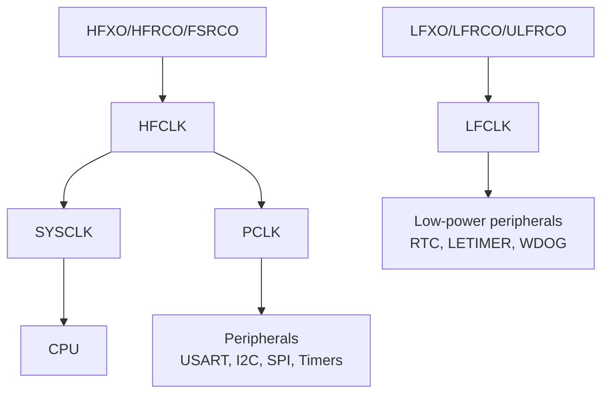

# Clock Management Module

**Module**: `efr32mg24_hal::clock`
**Status**: Initial Implementation
**Version**: 0.1.0

---

## Overview

The clock module provides type-safe configuration and management of the EFR32MG24's Clock Management Unit (CMU). It handles configuration of various clock sources and provides frozen clock frequencies for use by other peripheral modules.

## Hardware Capabilities

### Clock Sources

The EFR32MG24B220 provides multiple clock sources:

#### High Frequency Clocks
- **HFXO** (High Frequency Crystal Oscillator)
  - External crystal oscillator
  - XIAO MG24: 39 MHz crystal
  - Provides accurate, stable frequency for radio and peripherals
  - Lower power than RC oscillator at similar frequencies

- **HFRCO** (High Frequency RC Oscillator)
  - Internal RC oscillator
  - Default: 19 MHz
  - Can be configured from 1 MHz to 80 MHz
  - Fast startup, no external components needed

#### Low Frequency Clocks
- **LFXO** (Low Frequency Crystal Oscillator)
  - 32.768 kHz external crystal
  - Ultra-low power
  - High accuracy for RTC and timing

- **LFRCO** (Low Frequency RC Oscillator)
  - Internal 32.768 kHz RC oscillator
  - Moderate accuracy
  - No external components needed

#### Additional Clocks
- **FSRCO**: Fast Startup RC Oscillator (20 MHz)
- **ULFRCO**: Ultra Low Frequency RC Oscillator (1 kHz)

### Clock Tree



## Usage Examples

### Basic Configuration with External Crystal (XIAO MG24)

```rust
use efr32mg24_hal::clock::{Clocks, ClockConfig, HfxoConfig, LfxoConfig};

// Configure with XIAO MG24's 39 MHz crystal
let clocks = Clocks::new(
    ClockConfig {
        hfxo: Some(HfxoConfig::new(39_000_000)),
        lfxo: Some(LfxoConfig::default()), // 32.768 kHz
    }
).freeze();

// Use frozen clocks with peripherals
let delay = Delay::new(cp.SYST, &clocks);
```

### Using Internal RC Oscillators

```rust
// Use internal oscillators (no external crystals)
let clocks = Clocks::new(
    ClockConfig::default() // Uses HFRCO (19 MHz) and LFRCO (32.768 kHz)
).freeze();
```

### Accessing Clock Frequencies

```rust
let frozen_clocks = clocks.freeze();

println!("HFCLK: {} Hz", frozen_clocks.hfclk().0);
println!("LFCLK: {} Hz", frozen_clocks.lfclk().0);
println!("PCLK:  {} Hz", frozen_clocks.pclk().0);
```

## Performance Characteristics

### Clock Source Characteristics

| Source | Frequency      | Accuracy       | Startup Time | Power (typical) |
|--------|----------------|----------------|--------------|-----------------|
| HFXO   | 38-40 MHz      | ±20-50 ppm     | ~600 μs      | ~200 μA         |
| HFRCO  | 1-80 MHz       | ±2%            | ~1 μs        | ~400 μA @ 39MHz |
| LFXO   | 32.768 kHz     | ±20 ppm        | ~600 ms      | ~0.2 μA         |
| LFRCO  | ~32.768 kHz    | ±4%            | ~4 μs        | ~0.3 μA         |
| FSRCO  | 20 MHz         | ±10%           | Instant      | N/A (startup)   |
| ULFRCO | 1 kHz          | ±30%           | Instant      | ~0.02 μA        |

### Recommendations

- **Use HFXO** for radio operations (BLE, Thread, Zigbee, Matter) - requires accuracy
- **Use LFXO** for accurate timekeeping and ultra-low power sleep modes
- **Use HFRCO** for quick startup or when crystal not available
- **Use LFRCO** when LFXO not available and accuracy less critical

## Hardware Considerations

### External Crystals

**XIAO MG24 Sense** includes:
- 39 MHz HFXO crystal (for radio)
- 32.768 kHz LFXO crystal (for RTC)

For custom boards without crystals:
- Use internal RC oscillators
- Note reduced accuracy affects radio protocols and timekeeping

### Power Optimization

- Use LFXO in EM2/EM3 sleep modes for lowest power
- Switch to FSRCO during wakeup for fast response
- Disable unused clock branches to save power

## Safety and Security Notes

### TrustZone-M

The EFR32MG24 supports TrustZone-M with secure and non-secure clock management:
- This implementation uses `CMU_NS` (non-secure)
- Secure applications should use `CMU_S`
- Clock security can prevent non-secure code from disabling critical clocks

### Critical Section

Clock configuration changes should be atomic to prevent:
- Peripheral misconfiguration during clock switches
- Race conditions in multi-peripheral initialization

## Current Implementation Status

**Version 0.1.0** - Phase 2: Hardware Register Access Implemented

### Implemented
- [x] Clock configuration types (Hertz, HfxoConfig, LfxoConfig, ClockConfig)
- [x] Default frequency constants (HFRCO 19 MHz, LFRCO 32.768 kHz)
- [x] Frozen clock mechanism for peripheral sharing
- [x] Clean modular API structure
- [x] CMU peripheral consumption pattern (ensures exclusive access)
- [x] HFXO clock source selection via SYSCLKCTRL register
- [x] Clock frequency tracking and reporting
- [x] Safe register access with critical sections

### Module Structure

The clock module is split into manageable files:
- `mod.rs` (73 lines) - Module coordinator with documentation and examples
- `types.rs` (66 lines) - Type definitions for configurations
- `clocks.rs` (138 lines) - Clocks implementation with hardware register access
- `frozen.rs` (40 lines) - FrozenClocks immutable wrapper

### Hardware Register Access

This module directly manipulates EFR32MG24 CMU registers:

**Clock Source Selection:**
```rust
// Selecting HFXO writes to CMU_SYSCLKCTRL register
cmu.sysclkctrl().modify(|_r, w| w.clksel().hfxo());
```

**Peripheral Consumption:**
```rust
// CMU peripheral is consumed to ensure exclusive clock configuration
let clocks = Clocks::new(dp.cmu_s, config);
```

### TODO (Future Enhancements)
- [ ] HFXO startup and stabilization wait (currently assumes quick startup)
- [ ] LFXO hardware configuration and selection
- [ ] HFRCO/LFRCO fine-tuning and calibration
- [ ] Clock prescalers and dividers
- [ ] Dynamic clock switching and ramping
- [ ] Frequency measurement using CMU_CALCNT
- [ ] Power optimization features (clock gating, dynamic frequency scaling)

## Module Dependencies

### Required PAC Peripherals
- `CMU_NS` - Clock Management Unit (non-secure)
- `HFXO0_NS` - High Frequency Crystal Oscillator
- `HFRCO0_NS` - High Frequency RC Oscillator
- `LFXO_NS` - Low Frequency Crystal Oscillator
- `LFRCO_NS` - Low Frequency RC Oscillator

### Used By
- `delay` - Requires clock frequencies for timing
- `gpio` - Requires HFCLK for GPIO clocking
- `serial` - Requires PCLK for baud rate calculation
- `i2c` - Requires PCLK for I2C clock generation
- `spi` - Requires PCLK for SPI clock generation
- `timer` - Requires clock frequencies for timer configuration

## References

- [EFR32MG24 Reference Manual](https://www.silabs.com/documents/public/reference-manuals/efr32xg24-rm.pdf) - Chapter 11: CMU
- [XIAO MG24 Hardware Details](../../docs/hardware/XIAO_MG24_HARDWARE.md)
- [Silicon Labs AN0016](https://www.silabs.com/documents/public/application-notes/an0016-efm32-series-0-oscillators.pdf) - Oscillator Configuration

---

**Last Updated**: December 4, 2025 (Phase 2 - Hardware Register Access)
**Author**: EFR32MG24 HAL Project
