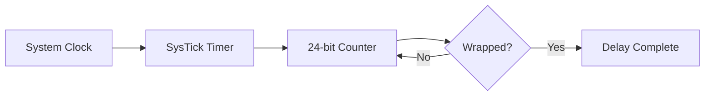

# Delay Module

**Module**: `efr32mg24_hal::delay`
**Status**: Fully Implemented
**Version**: 0.1.0

---

## Overview

The delay module provides blocking delay functions using the ARM Cortex-M SysTick timer. It implements the `embedded-hal` `DelayNs` trait, providing portable delay functionality for nanosecond, microsecond, and millisecond delays.

## Hardware Implementation

### SysTick Timer

The SysTick timer is a 24-bit down-counter built into the ARM Cortex-M33 core:

- **Resolution**: 24-bit (16,777,215 maximum count)
- **Clock Source**: Core clock (SYSCLK)
- **Precision**: Depends on system clock frequency
  - At 39 MHz: ~25.6 ns per tick
  - At 19 MHz: ~52.6 ns per tick
- **Operation**: Down-counting from reload value to zero



## Usage

### Basic Delay Operations

```rust
use efr32mg24_hal::{clock::Clocks, delay::Delay, pac};
use embedded_hal::delay::DelayNs;

let cp = cortex_m::Peripherals::take().unwrap();
let dp = pac::Peripherals::take().unwrap();

// Configure clocks
let clocks = Clocks::new(dp.CMU_NS, Default::default()).freeze();

// Create delay provider
let mut delay = Delay::new(cp.SYST, &clocks);

// Millisecond delays
delay.delay_ms(1000);  // 1 second

// Microsecond delays
delay.delay_us(100);   // 100 microseconds

// Nanosecond delays
delay.delay_ns(500);   // 500 nanoseconds
```

### Using with Other Peripherals

```rust
// Release SysTick for other uses
let syst = delay.free();

// Use SysTick for something else (e.g., RTIC scheduling)
```

## Implementation Details

### Delay Precision

The delay implementation uses different strategies based on duration:

1. **Very short delays (< 1 μs)**
   - Uses `cortex_m::asm::delay()` (NOP loop)
   - Approximate timing based on instruction cycles
   - Good enough for sub-microsecond delays

2. **Short to medium delays (1 μs - ~430 ms @ 39 MHz)**
   - Single SysTick countdown
   - Precise timing based on system clock
   - Limited by 24-bit counter capacity

3. **Long delays (> 430 ms)**
   - Multiple SysTick countdowns
   - Splits delay into chunks
   - No limit on delay duration

### Timing Calculations

```rust
// Nanoseconds to ticks
ticks = (nanoseconds * sysclk_hz) / 1_000_000_000

// Microseconds to ticks
ticks = (microseconds * sysclk_hz) / 1_000_000

// Maximum single delay (24-bit limit)
max_ticks = 0x00FF_FFFF  // 16,777,215
max_delay = max_ticks / sysclk_hz
// At 39 MHz: ~430 ms
// At 19 MHz: ~883 ms
```

### Example: Delay Accuracy

At 39 MHz system clock:
- Tick period: 25.64 ns
- 1 ms delay: 39,000 ticks (exact)
- 1 μs delay: 39 ticks (1.025 μs actual)
- 100 ns delay: ~4 ticks via NOP loop (approximate)

## Performance Characteristics

### Blocking Behavior

All delay functions are **blocking** and will prevent code execution during the delay:
- CPU remains in active run mode
- Power consumption: ~4-8 mA (depending on clock speed)
- Interrupts can still fire (if enabled)

### Overhead

- Function call overhead: ~few cycles
- SysTick configuration: ~10 cycles per countdown
- For very short delays, overhead may be significant

### Comparison with Alternatives

| Method | Precision | Power | Non-blocking | Use Case |
|--------|-----------|-------|--------------|----------|
| SysTick | High | Medium | No | General delays |
| Timer | High | Low | Yes | Background timing |
| WFI loop | Low | Very Low | No | Power-saving delays |
| NOP loop | Medium | High | No | Ultra-short delays |

## Limitations

1. **Blocking operation**: CPU is idle during delay
2. **24-bit counter**: Requires splitting for very long delays
3. **Power consumption**: Not suitable for low-power applications
4. **Clock dependent**: Accuracy depends on system clock stability

## Best Practices

### When to Use Delays

- Initialization sequences requiring specific timing
- Simple LED blinking and debugging
- Protocol timing requirements (bit-banging)
- Sensor stabilization periods

### When NOT to Use Delays

- Long wait periods in battery-powered devices (use sleep modes)
- Real-time applications (use timers and interrupts)
- Multiple concurrent timing operations (use timer peripherals)
- During interrupt handlers (may block other interrupts)

## Alternative Timing Methods

For non-blocking timing, consider:

```rust
// Using timers (future implementation)
let timer = Timer::new(dp.TIMER0, &clocks);
timer.start(1.secs());

// Check periodically
if timer.wait().is_ok() {
    // Timer expired
}
```

For low-power delays:

```rust
// Using RTC for long delays (future implementation)
let rtc = Rtc::new(dp.RTCC, &clocks);
rtc.sleep(Duration::from_secs(60));  // Sleep for 1 minute
```

## Module Dependencies

### Required Crates
- `cortex-m` - SysTick peripheral access
- `embedded-hal` - DelayNs trait

### Uses From HAL
- `clock::FrozenClocks` - System clock frequency
- `clock::Hertz` - Frequency representation

## References

- [ARM Cortex-M33 Technical Reference Manual](https://developer.arm.com/documentation/100230/latest/) - SysTick Timer
- [embedded-hal Documentation](https://docs.rs/embedded-hal/latest/embedded_hal/delay/trait.DelayNs.html)
- [EFR32MG24 Reference Manual](https://www.silabs.com/documents/public/reference-manuals/efr32xg24-rm.pdf)

---

**Last Updated**: December 4, 2025 (Phase 2 - Verified with CMU Integration)
**Author**: EFR32MG24 HAL Project
