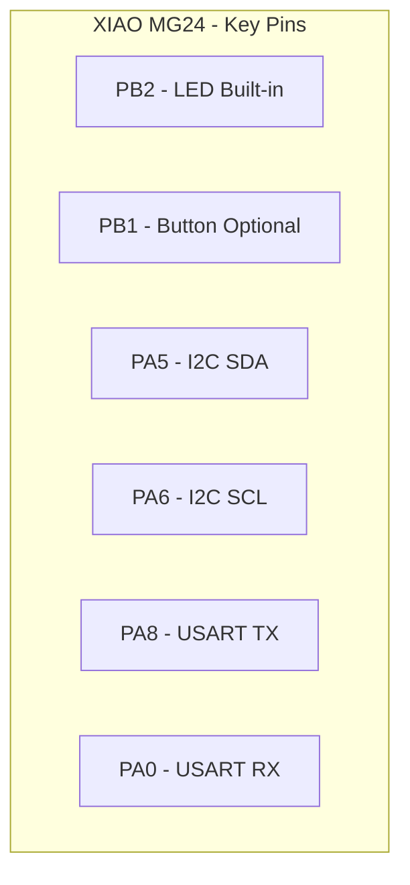

# GPIO Module

**Module**: `efr32mg24_hal::gpio`
**Status**: Initial Implementation
**Version**: 0.1.0

---

## Overview

The GPIO (General Purpose Input/Output) module provides type-safe, zero-cost abstractions for controlling digital pins on the EFR32MG24. The module leverages Rust's type system to prevent common errors at compile time, such as using a pin in the wrong mode or accessing unconfigured pins.

## Hardware Capabilities

### GPIO Ports

The EFR32MG24B220 (48-pin QFN package - XIAO MG24) provides 4 GPIO ports:

| Port | Available Pins | Notes |
|------|----------------|-------|
| Port A | PA0-PA8 | General purpose I/O |
| Port B | PB0-PB4 | Includes LED (PB2) and button on XIAO MG24 |
| Port C | PC0-PC3 | General purpose I/O |
| Port D | PD0-PD3 | General purpose I/O |

### Pin Capabilities

Each GPIO pin supports:

- **Digital Input**
  - Schmitt trigger input
  - Internal pull-up/pull-down resistors (20-50 kΩ typical)
  - Input filtering and debouncing
  - Interrupt capability (edge/level triggered)

- **Digital Output**
  - Push-pull output
  - Configurable drive strength (1 mA, 6 mA, 10 mA)
  - Slew rate control
  - Output value retention in sleep modes

- **Analog Function**
  - Can be configured for ADC input
  - Analog comparator input

- **Alternate Functions**
  - USART (TX, RX, CLK, CS)
  - I2C (SDA, SCL)
  - SPI (MOSI, MISO, CLK, CS)
  - Timer (CC, PWM)
  - And more...

### XIAO MG24 Pinout Reference



Key pins on XIAO MG24:
- **PB2**: Built-in LED (active high)
- **PB1**: User button (if connected, typically active low with pull-up)
- **PA5/PA6**: I2C SDA/SCL
- **PA8/PA0**: USART TX/RX for serial communication

## Type-Safe Pin Management

This module uses Rust's type system to enforce correct pin usage at compile time:

```rust
// Pins start in Input mode by default
let gpio = dp.GPIO_S.split();

// Can read from input
let is_high = gpio.pb1.is_high();  // OK

// Cannot write to input - won't compile!
// gpio.pb1.set_high();  // ERROR: no method `set_high` on type `Pin<Input>`

// Must convert to output first
let mut led = gpio.pb2.into_push_pull_output();
led.set_high().unwrap();  // OK now
```

### Available Pin Modes

1. **Input Modes**
   - `into_floating_input()` - No pull resistor
   - `into_pull_up_input()` - With pull-up resistor
   - `into_pull_down_input()` - With pull-down resistor

2. **Output Modes**
   - `into_push_pull_output()` - Standard drive strength (6 mA)
   - `into_push_pull_output_with_drive(strength)` - Custom drive strength

3. **Special Modes**
   - `into_analog()` - For ADC use
   - `into_alternate::<AF>()` - For peripheral functions

## Usage Examples

### Example 1: LED Blink

```rust
use efr32mg24_hal::{gpio::GpioExt, pac, prelude::*};

let dp = pac::Peripherals::take().unwrap();
let gpio = dp.GPIO_S.split();

// Configure PB2 as output (built-in LED on XIAO MG24)
let mut led = gpio.pb2.into_push_pull_output();

loop {
    led.set_high().unwrap();
    delay.delay_ms(500);
    led.set_low().unwrap();
    delay.delay_ms(500);
}
```

### Example 2: Button Input with Pull-up

```rust
use efr32mg24_hal::{gpio::GpioExt, pac, prelude::*};

let dp = pac::Peripherals::take().unwrap();
let gpio = dp.GPIO_S.split();

// Configure button with internal pull-up (active low)
let button = gpio.pb1.into_pull_up_input();

loop {
    if button.is_low().unwrap() {
        // Button is pressed
        led.set_high().unwrap();
    } else {
        led.set_low().unwrap();
    }
}
```

### Example 3: High Drive Strength Output

```rust
use efr32mg24_hal::{
    gpio::{GpioExt, DriveStrength},
    pac,
};

let dp = pac::Peripherals::take().unwrap();
let gpio = dp.GPIO_S.split();

// Use strong drive for external LED with high current
let mut external_led = gpio.pa0
    .into_push_pull_output_with_drive(DriveStrength::Strong);

external_led.set_high().unwrap();
```

### Example 4: Digital Input/Output Pattern

```rust
// Configure multiple pins
let gpio = dp.GPIO_S.split();

let mut led1 = gpio.pb2.into_push_pull_output();
let mut led2 = gpio.pa1.into_push_pull_output();
let button1 = gpio.pb1.into_pull_up_input();
let button2 = gpio.pb0.into_pull_down_input();

// Control LEDs based on button states
loop {
    if button1.is_low().unwrap() {
        led1.set_high().unwrap();
    } else {
        led1.set_low().unwrap();
    }

    if button2.is_high().unwrap() {
        led2.set_high().unwrap();
    } else {
        led2.set_low().unwrap();
    }
}
```

## Performance Characteristics

### Drive Strength

| Strength | Current | Use Case |
|----------|---------|----------|
| Weak     | 1 mA    | Low-power indicators, signals to high-impedance inputs |
| Standard | 6 mA    | General purpose, most LEDs with resistors |
| Strong   | 10 mA   | High-current LEDs, driving capacitive loads |

### Timing

- **GPIO toggle rate**: Up to 39 MHz (at 78 MHz system clock)
- **Input sampling**: Synchronized to peripheral clock
- **Pull-up/down resistance**: 20-50 kΩ (typical 30 kΩ)

### Power Consumption

- **Digital output**: ~0.1 μA per pin (when not driving load)
- **Digital input**: ~0.1 μA per pin
- **Pull resistor**: ~100 μA at 3.3V (with 30 kΩ typical)

## Hardware Design Considerations

### Current Limiting

Always use current-limiting resistors with LEDs:

```
Maximum LED current without resistor:
- Weak: 1 mA
- Standard: 6 mA
- Strong: 10 mA

Recommended LED circuit:
GPIO Pin ---[330Ω resistor]---[LED]--- GND

Current = (3.3V - LED_Vf) / 330Ω
For red LED (Vf ≈ 2.0V): I ≈ 4 mA (within Standard range)
```

### Pull Resistors

Internal pull-up/down resistors are relatively weak (30 kΩ typical):

```rust
// Good: Internal pull-up for button (low current)
let button = gpio.pb1.into_pull_up_input();

// May need external pull-up for:
// - I2C (requires stronger pull-ups, typically 4.7 kΩ)
// - High-speed signals
// - Noise-sensitive inputs
```

### Input Protection

- All GPIO pins include ESD protection
- Maximum input voltage: 3.3V + 0.3V
- Minimum input voltage: -0.3V
- Exceeding these voltages can damage the device

## Safety and Best Practices

### Type Safety

The module uses Rust's type system to prevent errors:

```rust
// ✓ Safe: Can only call methods valid for current mode
let input_pin = gpio.pb1.into_floating_input();
let value = input_pin.is_high();  // OK

// ✗ Won't compile: Can't write to input
// input_pin.set_high();  // ERROR

// ✓ Safe: Mode change is explicit
let mut output_pin = input_pin.into_push_pull_output();
output_pin.set_high();  // OK now
```

### Ownership and Uniqueness

Each pin can only be owned by one part of the code:

```rust
let gpio = dp.GPIO_S.split();
let mut led = gpio.pb2.into_push_pull_output();

// Cannot use pb2 again - it was consumed
// let mut led2 = gpio.pb2.into_push_pull_output();  // ERROR

// Must pass led by reference if needed elsewhere
control_led(&mut led);
```

### Safe API with Minimal Unsafe

The public API is completely safe Rust:

- Pin uniqueness enforced by consuming the GPIO peripheral
- No unsafe code in public API
- Unsafe blocks isolated to hardware register access (internal implementation)
- All register access protected by critical sections
- No risk of data races or memory unsafety in user code

## Hardware Register Implementation

This module directly manipulates EFR32MG24 GPIO registers:

### Pin Mode Configuration

Pin modes are configured using the PORTx_MODEL and PORTx_MODEH registers:

```rust
// Configuring PB2 as push-pull output writes to PORTB_MODEL register
// Sets mode field for pin 2 to value 0x4 (PUSHPULL)
gpio.portb.pb2.into_push_pull_output();
```

**Register Values**:
- `0x0`: DISABLED
- `0x1`: INPUT
- `0x2`: INPUTPULL (with pull direction from DOUT)
- `0x4`: PUSHPULL

### Pull Resistor Configuration

Pull direction is controlled by the DOUT register value when in INPUTPULL mode:

```rust
// For pull-up: DOUT bit = 1, then set mode to INPUTPULL
// For pull-down: DOUT bit = 0, then set mode to INPUTPULL
gpio.pb1.into_pull_up_input();
```

### Digital Output

Output operations use read-modify-write on DOUT register with critical sections:

```rust
// set_high(): DOUT |= (1 << pin)
// set_low():  DOUT &= ~(1 << pin)
led.set_high().unwrap();
```

**Note**: EFR32MG24 does not have atomic DOUTSET/DOUTCLR/DOUTTGL registers, so critical sections are required.

### Digital Input

Input reads directly from DIN register:

```rust
// Reads PORTx_DIN register and checks pin bit
let state = button.is_high().unwrap();
```

### Clock Enable

GPIO clock is automatically enabled during `split()`:

```rust
// Enables GPIO clock in CMU_CLKEN0 register
let gpio = dp.GPIO_S.split();
```

## Current Implementation Status

**Version 0.1.0** - Hardware Register Access Implemented (Phase 2)

### Implemented

- [x] Type-safe pin modes (Input, Output, Analog, Alternate)
- [x] Pin mode conversion methods with hardware register writes
- [x] embedded-hal v1.0 trait implementations
- [x] Drive strength configuration types
- [x] Pull resistor configuration (via INPUTPULL mode + DOUT)
- [x] Safe public API (unsafe isolated to register access)
- [x] Port A, B, C, D pin definitions
- [x] Actual GPIO register configuration (MODEL/MODEH)
- [x] Hardware-backed set/reset operations (DOUT register)
- [x] Hardware-backed read operations (DIN register)
- [x] Critical section protection for register access
- [x] Automatic GPIO clock enable in CMU

### Module Structure

The GPIO module is split into manageable files:
- `mod.rs` (104 lines) - Module coordinator and GpioExt trait
- `types.rs` (155 lines) - Type definitions, enums, port structures
- `pin.rs` (248 lines) - Pin implementation with hardware register access
- `traits.rs` (110 lines) - embedded-hal trait implementations

### TODO (Future Enhancements)

- [ ] Drive strength register configuration (currently uses defaults)
- [ ] Slew rate control
- [ ] GPIO interrupts (EXTI)
- [ ] Interrupt edge/level configuration
- [ ] Alternate function routing
- [ ] Output value retention in sleep modes
- [ ] GPIO port batch operations

## Module Dependencies

### Required PAC Peripherals

- `GPIO_S` - GPIO peripheral (secure)
- `GPIO_NS` - GPIO peripheral (non-secure)
- `CMU_NS` - For GPIO clock enable

### Used By

- All peripheral drivers that need GPIO pins
- Application code for digital I/O
- Example applications

### Depends On

- `efr32mg24-pac` - Peripheral Access Crate
- `embedded-hal` - Standard traits

## References

- [EFR32MG24 Reference Manual](https://www.silabs.com/documents/public/reference-manuals/efr32xg24-rm.pdf) - Chapter 18: GPIO
- [XIAO MG24 Hardware Details](../../docs/hardware/XIAO_MG24_HARDWARE.md)
- [embedded-hal documentation](https://docs.rs/embedded-hal/latest/embedded_hal/)
- [Silicon Labs AN0065](https://www.silabs.com/documents/public/application-notes/an0065-efm32-gpio.pdf) - GPIO Application Note

---

**Last Updated**: December 4, 2025 (Phase 2 - Hardware Register Access)
**Author**: EFR32MG24 HAL Project
